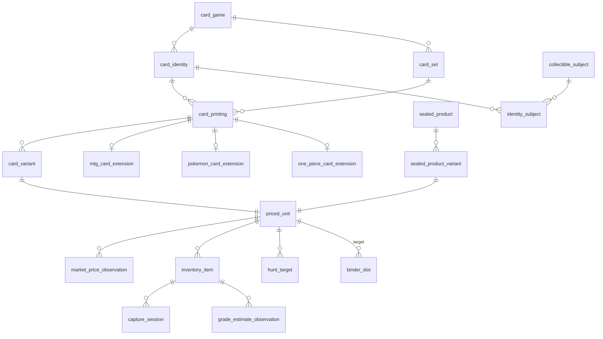

# Multi-Game Trading Card Schema — Proposal for Review

**Status:** APPROVED FOR STEP 1. Decisions in §16 resolved 2026-08-17. No migrations executed. No production data touched.
**Target schema:** `vault_tcg` (new), coexisting with `vault_core`, `vault_collection`, `vault_market`, `vault_pokemon`, `vault_mtg`.
**Date:** 2026-08-17

---

## 0. Blockers and corrections to the spec (read this first)

These are the places where the spec as written will produce a schema that breaks under real data. Each has a recommended resolution encoded in the design below.

### B1. TCGplayer cannot be the initial provider
The spec names `TCGProvider` as the first `CatalogProvider`. TCGplayer's public API has been closed to new developers since mid-2026. The provider interface is correct; the launch provider is not.

**Resolution:** launch order is Scryfall (MTG — free, stable, complete finish/frame/collector-number data), Pokémon TCG API (pokemontcg.io), and a **manual-curated provider** for One Piece. Bandai publishes no first-party catalog API; community datasets exist but have no licensing guarantee. One Piece catalog completeness is the single largest data risk in this pass, and it is a content problem, not a schema problem. Pricing stays behind the existing sold-comps swap seam and is not part of the catalog provider.

### B2. There is no "card identity" level, and three of your requirements need it
Test A ("search Nami returns every printing and treatment"), duplicate rule level 2 ("same underlying card, not duplicates for collecting purposes"), and MTG format legality all operate above the printing. MTG's oracle card is the obvious case; One Piece's `OP01-016` and Pokémon's cross-set reprints are the same problem.

**Resolution:** add `card_identity` above `card_printing`. Four catalog levels, not three.

### B3. Treatments as an unordered `text[]` destroys every pricing join
`["foil","borderless","comic_cover"]` and `["comic_cover","foil","borderless"]` are the same product and different rows. Nothing can join a market observation to a variant reliably.

**Resolution:** treatments become a reference table with an **axis** (`finish`, `border`, `frame`, `art`, `rarity_treatment`, `serialization`). A variant holds at most one treatment per axis, which makes the set deterministic, prevents `["foil","foil"]`, and yields a stable generated `treatment_signature` for the unique index.

### B4. `price_type` conflates three orthogonal dimensions
The spec's enum mixes price kind (`market`, `low`, `last_sale`), sale channel (`auction`, `buylist`, `dealer`), and subject condition (`raw_nm`, `psa_9`, `psa_10`). Any query filtering "PSA 10 last sale at auction" is impossible without string parsing.

**Resolution:** split into `price_type`, `channel`, and `condition_key`, where `condition_key` is a reference table (`raw:nm`, `psa:10`, `cgc:9.5`, `sealed:sealed`).

### B5. `current_market_value`, `insurance_value`, and `grade_prediction` on `inventory_item` violate your own non-negotiables
Market price is always a time-series observation. Grade estimates are model outputs that are never silently overwritten and can land in permanent `needs_review`.

**Resolution:** those three columns are deleted from `inventory_item`. Valuation is a view over `market_price_observation`. Grade estimates are rows in `grade_estimate_observation` with model version and confidence.

### B6. `collectible_subject.cultural_score` contradicts §17
§13 puts scores on the entity row; §17 correctly says scores are versioned with evidence. §17 wins.

### B7. Language is specified in two places with two meanings
The spec puts `language` on the printing (§3) and again as a search/inventory field (§23). For Pokémon, Japanese sets are genuinely different sets with different codes. For MTG, one collector number exists in eleven languages. If language sits only on printing, MTG needs eleven near-duplicate printing rows; if it sits only on inventory, Japanese and English Nami collapse into one priced unit and your comps are garbage.

**Resolution:** `language` on `card_printing`, and the printing's uniqueness key includes it. MTG printings are materialized per language **only for languages actually present in the catalog** (Scryfall exposes this). This is an explicit ambiguous decision — flagged again in §16 Risks.

### B8. The single largest structural improvement: `priced_unit`
Pricing, hunts, binder placeholders, duplicate detection, sell queue, and signals each need to point at "the thing that has a market." Right now the spec has each of them independently carry `(printing_id, variant_id)` — and sealed product can't participate at all, so §19–20 become a parallel universe with a second pricing table.

**Resolution:** introduce `priced_unit` as a first-class polymorphic entity over `card_variant` and `sealed_product_variant`. Everything downstream keys on `priced_unit_id`. This is the change that makes "MTG and One Piece flow through the same Stage 3.1 sell queue" (Test H) a schema fact rather than application discipline. It also matches your existing *priced unit* terminology.

### B9. Scope
Eighteen deliverables in one pass is how this stalls. The schema spine (§1–9) is buildable and testable this week. The game extensions are a day each after that. Recommended sequence is §17.

---

## 1. Hierarchy

```
card_game
 └── card_identity              ← "Nami OP01-016", MTG oracle card
      └── card_printing         ← identity as printed in a set, in a language
           └── card_variant     ← treatment/finish combination
                └── priced_unit ← the tradable thing (also covers sealed)
                     └── inventory_item  ← the physical copy you own
                          └── capture_session → capture_asset
```

### ERD (core spine)



---

## 2. Reference tables (open sets — no migration to add a value)

```sql
BEGIN;
SET search_path = vault_tcg, public;

CREATE TABLE card_game (
    id            uuid PRIMARY KEY DEFAULT public.uuid_generate_v4(),
    code          text NOT NULL UNIQUE,          -- pokemon | mtg | one_piece | lorcana | gundam | yugioh
    name          text NOT NULL,
    publisher     text,
    is_active     boolean NOT NULL DEFAULT true,
    created_at    timestamptz NOT NULL DEFAULT now()
);
COMMENT ON TABLE card_game IS 'Adding a game is a data insert, never a migration.';

CREATE TABLE treatment (
    code          text PRIMARY KEY,              -- foil | borderless | manga_rare | sp | parallel ...
    name          text NOT NULL,
    axis          text NOT NULL,                 -- finish|border|frame|art|rarity_treatment|serialization
    sort_order    int  NOT NULL DEFAULT 0,
    CONSTRAINT treatment_axis_ck CHECK (axis IN
      ('finish','border','frame','art','rarity_treatment','serialization'))
);
COMMENT ON TABLE treatment IS 'A variant carries at most one treatment per axis. This is what makes the treatment set deterministic.';

CREATE TABLE game_treatment (                    -- which treatments are legal per game
    game_id       uuid NOT NULL REFERENCES card_game(id),
    treatment_code text NOT NULL REFERENCES treatment(code),
    PRIMARY KEY (game_id, treatment_code)
);

CREATE TABLE rarity (                            -- rarity is game-specific, never a global enum
    id            uuid PRIMARY KEY DEFAULT public.uuid_generate_v4(),
    game_id       uuid NOT NULL REFERENCES card_game(id),
    code          text NOT NULL,                 -- SR | SEC | IR | SIR | mythic | L
    name          text NOT NULL,
    sort_order    int NOT NULL DEFAULT 0,
    UNIQUE (game_id, code)
);

CREATE TABLE condition_key (
    key           text PRIMARY KEY,              -- raw:nm | raw:lp | psa:10 | cgc:9.5 | sealed:sealed | any
    kind          text NOT NULL,                 -- raw | graded | sealed | wildcard
    grader        text,                          -- PSA | CGC | BGS | TAG | null
    grade_value   numeric(4,2),
    is_wildcard   boolean NOT NULL DEFAULT false,
    sort_order    int NOT NULL DEFAULT 0
);
INSERT INTO condition_key (key, kind, is_wildcard, sort_order)
VALUES ('any', 'wildcard', true, 0);
COMMENT ON TABLE condition_key IS 'One vocabulary shared by inventory, pricing, hunts and listings. Replaces the condition values previously buried in price_type. The ''any'' row exists so a wildcard is an explicit value rather than a NULL that cannot be distinguished from an omission.';
COMMIT;
```

**Enum strategy:** Postgres native enums only for closed, rarely-changing sets (`unit_kind`, `price_type`, `channel`, `slot_status`, `inventory_bucket`, `hunt_status`). Everything open-ended — games, treatments, rarities, product types, condition keys — is a reference table. This is what satisfies §4's "extensible without schema migrations for every new game."

---

## 3. Catalog spine

```sql
CREATE TABLE card_identity (
    id             uuid PRIMARY KEY DEFAULT public.uuid_generate_v4(),
    game_id        uuid NOT NULL REFERENCES card_game(id),
    canonical_name text NOT NULL,
    identity_code  text,                          -- OP01-016 | MTG oracle_id | null
    provider_ids   jsonb NOT NULL DEFAULT '{}'::jsonb,
    created_at     timestamptz NOT NULL DEFAULT now(),
    UNIQUE (game_id, identity_code)
);
COMMENT ON TABLE card_identity IS 'The underlying card. Serves Test A search and duplicate rule level 2.';

CREATE TABLE card_set (
    id             uuid PRIMARY KEY DEFAULT public.uuid_generate_v4(),
    game_id        uuid NOT NULL REFERENCES card_game(id),
    code           text NOT NULL,                 -- sv3pt5 | MAR | OP01
    name           text NOT NULL,
    series         text, block text,
    release_date   date,
    printed_total  int, total_cards int,
    set_type       text, is_promo_set boolean NOT NULL DEFAULT false,
    language       text,                          -- null when the set is language-neutral
    logo_url text, symbol_url text,
    provider_ids   jsonb NOT NULL DEFAULT '{}'::jsonb,
    UNIQUE (game_id, code, language)
);

CREATE TABLE card_printing (
    id                uuid PRIMARY KEY DEFAULT public.uuid_generate_v4(),
    identity_id       uuid NOT NULL REFERENCES card_identity(id),
    set_id            uuid NOT NULL REFERENCES card_set(id),
    collector_number  text NOT NULL,
    printed_number    text,
    language          text NOT NULL DEFAULT 'en',
    rarity_id         uuid REFERENCES rarity(id),
    supertype text, card_type text, subtypes text[],
    artist text, illustration_id text,
    rules_text text, flavor_text text,
    front_image_url text, back_image_url text,
    orientation       text NOT NULL DEFAULT 'portrait',
    is_promo boolean NOT NULL DEFAULT false,
    is_token boolean NOT NULL DEFAULT false,
    is_reprint boolean NOT NULL DEFAULT false,
    is_first_printing boolean NOT NULL DEFAULT false,
    provider_ids      jsonb NOT NULL DEFAULT '{}'::jsonb,
    created_at timestamptz NOT NULL DEFAULT now(),
    updated_at timestamptz NOT NULL DEFAULT now(),
    UNIQUE (set_id, collector_number, language)
);
CREATE INDEX ON card_printing USING gin (provider_ids jsonb_path_ops);

CREATE TABLE card_variant (
    id             uuid PRIMARY KEY DEFAULT public.uuid_generate_v4(),
    printing_id    uuid NOT NULL REFERENCES card_printing(id) ON DELETE CASCADE,
    is_serialized  boolean NOT NULL DEFAULT false,
    numbered_to    int,
    print_run      int,
    provider_ids   jsonb NOT NULL DEFAULT '{}'::jsonb,
    treatment_signature text NOT NULL,            -- maintained by trigger: sorted codes, '|' joined
    UNIQUE (printing_id, treatment_signature)
);

CREATE TABLE card_variant_treatment (
    variant_id     uuid NOT NULL REFERENCES card_variant(id) ON DELETE CASCADE,
    treatment_code text NOT NULL REFERENCES treatment(code),
    axis           text NOT NULL,
    PRIMARY KEY (variant_id, treatment_code),
    UNIQUE (variant_id, axis)                     -- one treatment per axis. This is the whole trick.
);
```

`treatment_signature` is maintained by an `AFTER INSERT/DELETE` trigger on `card_variant_treatment` that rewrites it as the sorted, `|`-joined code list (`standard` when empty). Deterministic, indexable, joinable.

---

## 4. Priced unit — the join key for everything downstream

**Decision 4 (resolved):** condition/grade is **not** part of priced-unit identity. A priced unit is the catalog-level tradable object; condition is a dimension carried by pricing, inventory, hunts, and slots.

```sql
CREATE TYPE unit_kind AS ENUM ('card','sealed');

CREATE TABLE priced_unit (
    id                       uuid PRIMARY KEY DEFAULT public.uuid_generate_v4(),
    kind                     unit_kind NOT NULL,
    card_variant_id          uuid UNIQUE REFERENCES card_variant(id) ON DELETE CASCADE,
    sealed_product_variant_id uuid UNIQUE REFERENCES sealed_product_variant(id) ON DELETE CASCADE,
    canonical_key            text NOT NULL UNIQUE,   -- op01|OP01-016|en|art:alternate_art
    created_at               timestamptz NOT NULL DEFAULT now(),
    CONSTRAINT priced_unit_exactly_one_ck CHECK (
        (kind = 'card'   AND card_variant_id IS NOT NULL AND sealed_product_variant_id IS NULL) OR
        (kind = 'sealed' AND sealed_product_variant_id IS NOT NULL AND card_variant_id IS NULL))
);
```

Created by trigger whenever a `card_variant` or `sealed_product_variant` is inserted. One unit per catalog object, no row inflation, no lazy-materialization discipline to enforce.

**Standing rule:** anything that prices, owns, hunts, or lists an object carries `(priced_unit_id, condition_key)` together. That pair is never split. It is not enforced by convention — see §5a, which makes splitting it structurally impossible rather than merely discouraged.

---

## 5. Pricing (replaces §9)

```sql
CREATE TYPE price_type AS ENUM
  ('market','low','mid','high','last_sale','listing_ask','completed_sale','buylist_bid','dealer_ask','msrp');
CREATE TYPE price_channel AS ENUM
  ('fixed_price','auction','buylist','dealer','retail','private','unknown');

CREATE TABLE market_price_observation (
    id             uuid PRIMARY KEY DEFAULT public.uuid_generate_v4(),
    priced_unit_id uuid NOT NULL REFERENCES priced_unit(id),
    condition_key  text NOT NULL REFERENCES condition_key(key),
    price_type     price_type NOT NULL,
    channel        price_channel NOT NULL DEFAULT 'unknown',
    marketplace    text NOT NULL,
    currency       char(3) NOT NULL DEFAULT 'USD',
    price          numeric(14,2) NOT NULL,
    observed_at    timestamptz NOT NULL,
    sample_size    int,
    confidence     numeric(3,2),
    source_reference jsonb NOT NULL DEFAULT '{}'::jsonb,
    ingested_at    timestamptz NOT NULL DEFAULT now()
);
CREATE INDEX ON market_price_observation (priced_unit_id, condition_key, observed_at DESC);
```

Append-only. No update path. Current value is a view:

```sql
CREATE VIEW v_priced_unit_current AS
SELECT DISTINCT ON (priced_unit_id, condition_key)
       priced_unit_id, condition_key, price, currency, price_type, channel, marketplace, observed_at
FROM market_price_observation
ORDER BY priced_unit_id, condition_key, observed_at DESC;
```

A raw-NM vs PSA-10 grading spread is a self-join on `priced_unit_id` across two `condition_key` values — the shape the Grading Optimizer consumes.

---

## 5a. Sealed access layer — why the pair cannot be split

The failure mode is not a broken query. It is a query that succeeds and returns a plausible blended number: raw NM comps averaged with PSA 10 comps, no error raised, a wrong valuation that looks right. Convention does not survive that, because nothing ever fails loudly enough to notice.

Four mechanisms, in order of how much they actually buy:

**1. Revoke the table. Ship functions that cannot be called without a condition.**

```sql
REVOKE ALL ON market_price_observation FROM vault_app;
GRANT INSERT ON market_price_observation TO vault_ingest;   -- writers only

CREATE FUNCTION price_series(
    p_priced_unit_id uuid,
    p_condition_key  text,                      -- no default. cannot be omitted.
    p_since          timestamptz DEFAULT now() - interval '180 days'
) RETURNS TABLE (observed_at timestamptz, price numeric, price_type price_type,
                 channel price_channel, marketplace text)
LANGUAGE sql STABLE SECURITY DEFINER AS $$
    SELECT o.observed_at, o.price, o.price_type, o.channel, o.marketplace
    FROM market_price_observation o
    WHERE o.priced_unit_id = p_priced_unit_id
      AND o.condition_key  = p_condition_key
      AND o.observed_at   >= p_since
    ORDER BY o.observed_at DESC;
$$;
GRANT EXECUTE ON FUNCTION price_series TO vault_app;
```

No default on `p_condition_key` means a caller who forgets it gets a function-resolution error at the point of the mistake. Compare that to a `WHERE` clause quietly missing a predicate.

**2. No unconditioned aggregate view exists to be reached for.** Every shipped view groups by `condition_key`, including `v_priced_unit_current`. There is no `v_unit_market_value` returning one number per unit, because that view has no correct definition. If someone needs a headline number, they pass a condition and get that condition's number.

**3. The app boundary handles one object, not two fields.**

```python
class UnitRef(BaseModel, frozen=True):
    priced_unit_id: UUID
    condition_key: str            # 'any' is explicit; there is no None

    @property
    def cache_key(self) -> str:
        return f"{self.priced_unit_id}:{self.condition_key}"
```

Every pricing, valuation, hunt-match, and listing call takes a `UnitRef`. You cannot forget half of a tuple you never handle in halves. Repository methods accept `UnitRef` only — never a bare `priced_unit_id` — and this is the rule that actually prevents the bug in day-to-day code.

**4. A fixture that makes blending arithmetically obvious.** Test K seeds one variant with `raw:nm` at $10 and `psa:10` at $500. Any query that blends returns something in the low hundreds. The test asserts exact values, so a blend fails by two orders of magnitude rather than by a few percent — loud, not subtle. This fixture belongs in the migration-verification gate too: run it against the backfilled data before cutover.

**Wildcards are explicit.** `condition_key = 'any'` is a real row. NULL never means "all conditions" anywhere in this schema, because NULL is indistinguishable from an omission, which is the exact bug being prevented. Hunt targets and binder slots use `'any'` and are `NOT NULL`.

---

## 6. Inventory (revised §7)

```sql
CREATE TYPE inventory_bucket AS ENUM
  ('personal_collection','museum','investment_vault','dealer_inventory',
   'sale_inventory','trade_inventory','grading_queue','research');

CREATE TABLE inventory_item (
    id                uuid PRIMARY KEY DEFAULT public.uuid_generate_v4(),
    owner_id          uuid NOT NULL,                       -- FK to vault_core tenant/user
    priced_unit_id    uuid NOT NULL REFERENCES priced_unit(id),
    condition_key     text NOT NULL REFERENCES condition_key(key),
    condition_notes   text,
    grading_status    text NOT NULL DEFAULT 'raw',
    cert_number       text,
    acquisition_date  date,
    acquisition_source text,
    acquisition_price numeric(14,2),
    cost_basis        numeric(14,2),
    bucket            inventory_bucket NOT NULL DEFAULT 'personal_collection',
    storage_container_id uuid,
    provenance        jsonb NOT NULL DEFAULT '{}'::jsonb,
    needs_review      boolean NOT NULL DEFAULT false,
    notes             text,
    created_at timestamptz NOT NULL DEFAULT now(),
    updated_at timestamptz NOT NULL DEFAULT now()
);
```

Removed vs spec: `current_market_value`, `insurance_value`, `grade_prediction`, `museum_status`, `investment_status`, `sell_status`, `duplicate_status`. The first three are observations. The last four are derived scores/queues and belong in the versioned score tables — otherwise you have four columns that silently go stale and no history when a recommendation flips.

`binder_id/page_id/slot` also removed — the assignment lives on `binder_slot`, one direction only.

`condition_key` on the item is the *current* condition, and it is never overwritten silently. Every change writes history first:

```sql
CREATE TABLE inventory_condition_event (
    id                uuid PRIMARY KEY DEFAULT public.uuid_generate_v4(),
    inventory_item_id uuid NOT NULL REFERENCES inventory_item(id),
    from_condition_key text REFERENCES condition_key(key),
    to_condition_key   text NOT NULL REFERENCES condition_key(key),
    reason            text NOT NULL,   -- initial | graded | regraded | crossover | reassessed | corrected | damaged
    cert_number       text,
    evidence          jsonb NOT NULL DEFAULT '{}'::jsonb,
    effective_at      timestamptz NOT NULL DEFAULT now()
);
CREATE INDEX ON inventory_condition_event (inventory_item_id, effective_at DESC);
```

Enforced by a `BEFORE UPDATE` trigger on `inventory_item`: a change to `condition_key` without a matching event row is rejected. This is what turns a grading submission that comes back below expectation into evidence for the Grading Optimizer rather than a lost write.

```sql
CREATE TABLE grade_estimate_observation (
    id                uuid PRIMARY KEY DEFAULT public.uuid_generate_v4(),
    inventory_item_id uuid NOT NULL REFERENCES inventory_item(id),
    model_version     text NOT NULL,
    grade_scale       text NOT NULL,
    grade_low         numeric(4,2), grade_high numeric(4,2), grade_point numeric(4,2),
    confidence        numeric(3,2),
    evidence          jsonb NOT NULL DEFAULT '{}'::jsonb,
    needs_review      boolean NOT NULL DEFAULT true,
    observed_at       timestamptz NOT NULL DEFAULT now()
);
```

Capture tables (`capture_session`, `capture_asset`) are reused unchanged from the existing Digital Clone architecture, re-pointed at `inventory_item.id`. Raw scans stay immutable.

---

## 7. Score observations (§17, versioned)

```sql
CREATE TABLE score_observation (
    id            uuid PRIMARY KEY DEFAULT public.uuid_generate_v4(),
    subject_kind  text NOT NULL,      -- priced_unit | inventory_item | binder_page | collectible_subject
    subject_id    uuid NOT NULL,
    score_name    text NOT NULL,      -- museum_score | investment_score | liquidity_score ...
    score_value   numeric(6,3) NOT NULL,
    score_version text NOT NULL,
    confidence    numeric(3,2),
    evidence      jsonb NOT NULL DEFAULT '{}'::jsonb,
    observed_at   timestamptz NOT NULL DEFAULT now()
);
CREATE INDEX ON score_observation (subject_kind, subject_id, score_name, observed_at DESC);
```

One table, not ten columns. Adding `grading_opportunity_score` is a data change.

---

## 8. Subjects (§13, corrected)

```sql
CREATE TABLE collectible_subject (
    id          uuid PRIMARY KEY DEFAULT public.uuid_generate_v4(),
    subject_type text NOT NULL,        -- character | athlete | artist | vehicle | property
    name        text NOT NULL,
    franchise   text,
    canonical_reference text,
    notes       text,
    UNIQUE (subject_type, name, franchise)
);

CREATE TABLE identity_subject (
    identity_id uuid NOT NULL REFERENCES card_identity(id) ON DELETE CASCADE,
    subject_id  uuid NOT NULL REFERENCES collectible_subject(id),
    role        text NOT NULL DEFAULT 'primary',   -- primary | cameo | depicted
    PRIMARY KEY (identity_id, subject_id, role)
);
```

No `game_id` on the subject — Spider-Man appears in MTG, comics, and sports-adjacent product. That's the entire point of the Cultural Icons binder. Cultural/demand scores go to `score_observation`.

---

## 9. Binder + hunts (merges §14, §15, §18)

```sql
CREATE TYPE slot_status AS ENUM ('empty','wanted','owned','upgraded_out','retired');

CREATE TABLE binder (
    id uuid PRIMARY KEY DEFAULT public.uuid_generate_v4(),
    owner_id uuid NOT NULL,
    name text NOT NULL,
    game_id uuid REFERENCES card_game(id),        -- nullable = cross-franchise
    collection_strategy text NOT NULL,            -- set_chase_page | cultural_icon_page | ...
    description text,
    created_at timestamptz NOT NULL DEFAULT now()
);

CREATE TABLE binder_page (
    id uuid PRIMARY KEY DEFAULT public.uuid_generate_v4(),
    binder_id uuid NOT NULL REFERENCES binder(id) ON DELETE CASCADE,
    page_number int NOT NULL,
    layout_type text NOT NULL DEFAULT '3x3',
    slot_count int NOT NULL DEFAULT 9,            -- not hard-coded to 9
    theme text, strategy text,
    UNIQUE (binder_id, page_number)
);

CREATE TABLE binder_slot (
    id uuid PRIMARY KEY DEFAULT public.uuid_generate_v4(),
    page_id uuid NOT NULL REFERENCES binder_page(id) ON DELETE CASCADE,
    slot_index int NOT NULL,
    target_priced_unit_id uuid REFERENCES priced_unit(id),
    target_condition_key text NOT NULL DEFAULT 'any' REFERENCES condition_key(key),
    inventory_item_id uuid UNIQUE REFERENCES inventory_item(id),
    status slot_status NOT NULL DEFAULT 'empty',
    UNIQUE (page_id, slot_index)
);
```

A slot with `target_priced_unit_id` and no `inventory_item_id` **is** the placeholder (§15). Filling it is one UPDATE: set `inventory_item_id`, flip status `wanted → owned`.

```sql
CREATE TYPE hunt_status AS ENUM ('watch','hunt','priority','found','owned','passed','retired');

CREATE TABLE hunt_target (
    id uuid PRIMARY KEY DEFAULT public.uuid_generate_v4(),
    owner_id uuid NOT NULL,
    priced_unit_id uuid NOT NULL REFERENCES priced_unit(id),
    desired_condition_key text NOT NULL DEFAULT 'any' REFERENCES condition_key(key),
    minimum_condition_key text REFERENCES condition_key(key),      -- floor when desired = 'any'
    target_buy_price numeric(14,2),
    maximum_buy_price numeric(14,2),
    priority int NOT NULL DEFAULT 3,
    binder_slot_id uuid REFERENCES binder_slot(id),
    reason text,
    status hunt_status NOT NULL DEFAULT 'watch',
    created_at timestamptz NOT NULL DEFAULT now()
);
```

Because hunts key on `priced_unit_id`, Store/Show/Auction/Trade modes get one lookup: scan → resolve priced unit → check hunts, inventory, and comps. A `desired_condition_key` of `'any'` matches at or above `minimum_condition_key`, so a field scan of a raw copy still fires against a hunt framed around a graded target.

---

## 10. Sealed (§19–20)

```sql
CREATE TABLE sealed_product (
    id uuid PRIMARY KEY DEFAULT public.uuid_generate_v4(),
    game_id uuid NOT NULL REFERENCES card_game(id),
    set_id uuid REFERENCES card_set(id),
    product_type text NOT NULL,         -- reference table value, not enum
    product_name text NOT NULL,
    language text NOT NULL DEFAULT 'en',
    release_date date,
    pack_count int, box_count int,
    promo_contents jsonb,
    provider_ids jsonb NOT NULL DEFAULT '{}'::jsonb
);

CREATE TABLE sealed_product_variant (
    id uuid PRIMARY KEY DEFAULT public.uuid_generate_v4(),
    sealed_product_id uuid NOT NULL REFERENCES sealed_product(id) ON DELETE CASCADE,
    art_variant_code text NOT NULL DEFAULT 'default',   -- art_1 ... art_4
    art_name text, image_url text,
    UNIQUE (sealed_product_id, art_variant_code)
);
```

Because `sealed_product_variant` gets its own `priced_unit`, the Phantasmal Flames sleeved-booster art archive works with zero new pricing, hunt, or binder machinery. Art 4 "wanted" is a hunt target like any card.

---

## 11. Game extensions

All extensions are `printing_id uuid PRIMARY KEY REFERENCES card_printing(id) ON DELETE CASCADE` plus game fields. One row max per printing, and the join is free.

**`mtg_card_extension`** — `mana_cost, mana_value, colors[], color_identity[], power, toughness, loyalty, defense, keywords[], layout, oracle_text, reserved_list, frame_version, is_double_faced, is_transform`.

**Legality is not on the extension.** It changes quarterly and is not a property of a printing:

```sql
CREATE TABLE mtg_legality_snapshot (
    identity_id uuid NOT NULL REFERENCES card_identity(id) ON DELETE CASCADE,
    format text NOT NULL,                  -- standard | modern | commander | pauper ...
    status text NOT NULL,                  -- legal | not_legal | banned | restricted
    as_of date NOT NULL,
    PRIMARY KEY (identity_id, format, as_of)
);
```

**`one_piece_card_extension`** — `card_color[], life, cost, power, counter, attribute, op_card_type, traits[], effect_text, trigger_text, leader_life, block_icon, product_family`.

**`pokemon_card_extension`** — existing fields, migrated as-is.

MTG treatments (`foil`, `etched_foil`, `surge_foil`, `galaxy_foil`, `borderless`, `extended_art`, `showcase`, `retro_frame`, `comic_cover`, `serialized`, `universes_beyond`) and One Piece treatments (`parallel`, `leader_parallel`, `sp`, `manga_rare`, `treasure_rare`, `winner`, `championship`, `stamped`, `alternate_art`) are `treatment` rows, assigned to their axes. Nothing structural.

---

## 12. Provider normalization

```python
class CatalogProvider(Protocol):
    code: str
    supported_games: set[str]

    def search_cards(self, q: CardQuery) -> list[RawCard]: ...
    def get_card(self, provider_id: str) -> RawCard: ...
    def get_set(self, provider_id: str) -> RawSet: ...
    def get_variants(self, provider_id: str) -> list[RawVariant]: ...
    def get_images(self, provider_id: str) -> list[RawImage]: ...
    def normalize(self, raw: RawCard) -> NormalizedPrinting: ...
```

```python
class NormalizedTreatment(BaseModel):
    code: str
    axis: Literal['finish','border','frame','art','rarity_treatment','serialization']

class NormalizedVariant(BaseModel):
    treatments: list[NormalizedTreatment]
    is_serialized: bool = False
    numbered_to: int | None = None
    provider_ids: dict[str, Any] = {}

class NormalizedPrinting(BaseModel):
    game_code: str
    identity_code: str | None
    canonical_name: str
    set_code: str
    collector_number: str
    language: str = 'en'
    rarity_code: str | None
    artist: str | None
    front_image_url: str | None
    variants: list[NormalizedVariant]
    subjects: list[str] = []
    extension: dict[str, Any] = {}      # goes to the game extension table
    provider_ids: dict[str, Any] = {}
```

Every provider write path is: `raw → normalize() → upsert_printing() → upsert_variants() → ensure_priced_units()`. Provider IDs land in `provider_ids` jsonb and never become a primary key (Test J).

Pricing providers stay separate (`PriceProvider`), behind the existing `getPricing()` swap seam.

---

## 13. Migration plan (existing Pokémon data)

Expand-and-contract. No in-place ALTER on live tables, no destructive step until the read path is proven.

1. **Create `vault_tcg`** with everything above. Zero writes to existing schemas.
2. **Seed reference data** — `card_game` (pokemon, mtg, one_piece), treatments + axes, condition keys, Pokémon rarities.
3. **Backfill Pokémon** in this order: sets → identities → printings → variants → priced units → extension rows. Deterministic keys so the backfill is re-runnable and idempotent, matching the comics loader precedent.
4. **Backfill inventory preserving UUIDs** — `INSERT ... SELECT id, ...` so every existing `inventory_item.id` survives. This is the non-negotiable that protects binder assignments, captures, and Signals references.
5. **Backfill pricing history** into `market_price_observation`, mapping old condition/grade fields to `condition_key`. Nothing is dropped or collapsed.
6. **Backfill binder** — pages, slots, assignments. Existing slot→card links become `inventory_item_id`; existing wanted entries become `target_priced_unit_id`.
7. **Compatibility views** in `vault_pokemon` with the old table names and column shapes, reading from `vault_tcg`. The API keeps working during cutover.
8. **Verification gate** — row counts, checksum on cost basis totals, spot-check 50 records, confirm no `needs_review` was auto-cleared. Nothing proceeds until this passes.
9. **Cutover** the API to `vault_tcg`.
10. **Contract** — drop the old physical tables only after a full backup and an agreed soak period. Separate migration, separate approval.

Migrations 17+ in the existing style: `BEGIN;`/`COMMIT;`, explicit `search_path`, `public.uuid_generate_v4()`, per-table comments.

---

## 14. API impact

| Route | Impact |
|---|---|
| `GET /games`, `/sets`, `/sets/{id}` | New. Low risk. |
| `GET /cards/search` | Rewritten. Must return identity + printings + variants, not flat cards. |
| `GET /cards/{id}/variants` | New. `{id}` should be the **identity** id, not the printing id. |
| `GET /cards/{id}/prices` | **Breaking.** Keys on `priced_unit_id`, returns a time series + current view, not a scalar. |
| `GET/POST /inventory` | Breaking: `printing_id + variant_id` → `priced_unit_id`; valuation fields move to a nested `valuation` object sourced from the view. |
| `GET /binders/{id}/pages`, `/targets` | Slot payload gains `target_priced_unit_id` and `status`. |
| `GET/POST /hunts` | Keys on `priced_unit_id`. |
| `GET/POST /sealed` | New, same shape as cards from the priced-unit level down. |
| `POST /providers/{provider}/sync` | New. Must be idempotent and log provider + fetch time into `provider_ids` / source refs. |

Recommend `/v2` for the breaking three rather than mutating v1 in place, since the collection viewer frontend is live.

---

## 15. Acceptance tests → mechanism

| Test | Satisfied by |
|---|---|
| A — search "Nami" returns all printings/treatments | `card_identity` + trigram index on `canonical_name`, joined down to variants |
| B — add Nami OP01-016 Alternate Art | variant with `art:alternate_art`, its priced unit, one inventory row |
| C — same card twice = physical duplicate | two `inventory_item` rows on one `priced_unit_id` + matching `condition_key` |
| D — standard ≠ alternate art | distinct `treatment_signature` → distinct variant → distinct priced unit |
| E — MTG foil ≠ nonfoil value | distinct `finish` axis treatment → distinct priced unit → separate price series |
| K — raw NM and PSA 10 price independently | one priced unit, two `condition_key` series; fixture seeds $10 and $500 so any blend fails by two orders of magnitude (§5a) |
| F — One Piece card in binder slot #1 | `binder_slot` references `inventory_item`, game-agnostic |
| G — placeholder without ownership | `binder_slot.target_priced_unit_id` with null `inventory_item_id`, status `wanted` |
| H — all three games in one sell queue | sell queue reads `inventory_item` + `priced_unit`; no game branch exists |
| I — prices stored historically | `market_price_observation` is append-only; no UPDATE path granted |
| J — provider IDs don't control identity | `provider_ids` jsonb, GIN-indexed, never a PK or FK |

Fixtures: existing Pokémon catalog fixture; 25 MTG Marvel cards spanning standard/foil/borderless/comic-cover; the nine One Piece cards listed in §26 including both Nami OP01-016 treatments. The Nami pair is the single most valuable fixture — it exercises identity, printing, variant, priced unit, and duplicate logic in one record.

---

## 16. Decision log (resolved 2026-08-17)

| # | Decision | Resolution |
|---|---|---|
| 1 | Language placement | **On printing.** Uniqueness is `(set_id, collector_number, language)`. MTG printings materialize per language only where the catalog exposes one. |
| 2 | One Piece catalog source | **Manual-curated fixtures** for this pass, behind the same `CatalogProvider` interface. No community dataset dependency until licensing is clear. |
| 3 | MTG treatment vs. printing | **Follow the provider's collector number.** Different number → new printing. Same number → new variant. Encoded in the importer, not the schema. |
| 4 | Graded copies | **Condition dimension, not identity.** One priced unit per catalog object; `condition_key` travels alongside it, enforced structurally per §5a. Pop reports and graded-object identity are out of scope until PSA is connected. |
| 5 | Sports cards and comics | **Out of scope** for `vault_tcg` this pass. `vault_comic` stays as-is. `priced_unit` is the future unification seam. |
| 6 | Existing `vault_mtg` | **Audit before step 3.** See below. |

### Open action — `vault_mtg` audit

Nothing in step 3 should run until this is answered:

```sql
SELECT c.relname AS table_name,
       c.reltuples::bigint AS approx_rows,
       pg_size_pretty(pg_total_relation_size(c.oid)) AS size
FROM pg_class c
JOIN pg_namespace n ON n.oid = c.relnamespace
WHERE n.nspname = 'vault_mtg' AND c.relkind = 'r'
ORDER BY c.reltuples DESC;
```

If every table is empty, `vault_mtg` is scaffolding and gets dropped during contract. If any table holds real rows, it needs its own backfill branch parallel to the Pokémon one, and step 5 moves ahead of step 3.

### Remaining risks (not decisions)

- **Split `(priced_unit_id, condition_key)` — mitigated, not eliminated.** §5a revokes the table, removes the unconditioned aggregate view, forces a `UnitRef` at the app boundary, and seeds a fixture where blending is off by 50x. What it does not cover is ad-hoc analyst SQL run directly against the database with elevated credentials. Keep the `vault_app` role in every application path so this stays a deliberate act rather than an accident.
- **Condition-key vocabulary drift.** `raw:nm` vs `raw:near_mint` from two importers splits one asset's price history in half. The vocabulary is a closed reference table for a reason; importers map into it and fail loudly on unknown values rather than inserting.
- **One Piece catalog completeness** remains the largest content risk regardless of schema quality.

**Explicitly out of scope this pass:** PSA/CGC pop-report ingestion, and the graded-object identity question that comes with it. Deferred until PSA is actually connected.

---

## 17. Recommended sequence

| Step | Content | Gate |
|---|---|---|
| 1 | Reference tables + catalog spine + priced unit (§2–4) | Nami fixture inserts, Tests D/E pass |
| 2 | Pricing + inventory + score observations (§5–7) | Tests C/I pass |
| 3 | Pokémon backfill with compat views (§13 steps 1–7) | Verification gate; zero data loss |
| 4 | Binder + hunts migration (§9) | Tests F/G pass |
| 5 | MTG extension + Scryfall provider + 25-card fixture | Test E on real data |
| 6 | One Piece extension + curated fixtures | Tests A/B/D on real data |
| 7 | Sealed + art variants (§10) | Phantasmal Flames archive works |
| 8 | API v2 + Stage 3.1 sell queue verification | Test H |
| 9 | Contract: drop legacy tables | Separate approval |

Steps 1–2 are the only ones that are hard. Everything after is mechanical.

---

**Nothing here has been executed.** Next action: run the `vault_mtg` audit query in §16, then step 1 (migration 17 — reference tables, catalog spine, priced unit) is clear to build.
